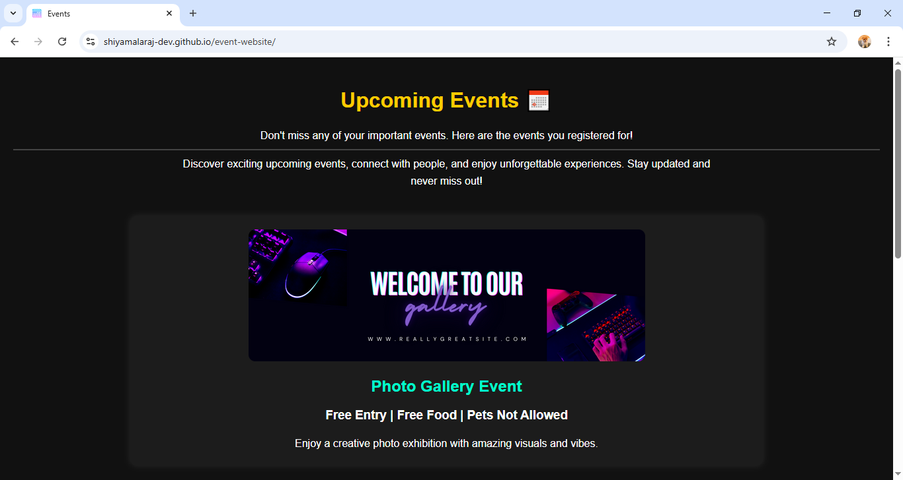
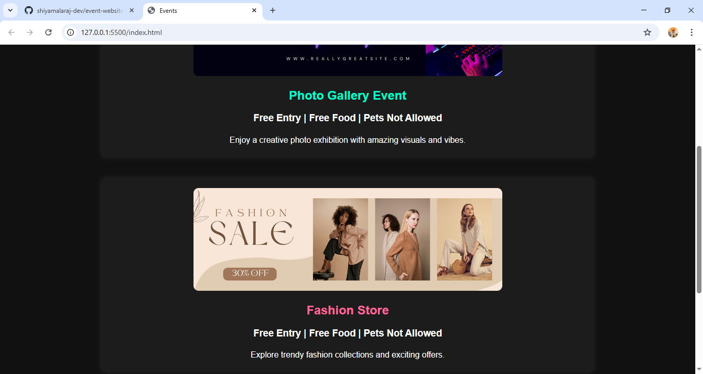
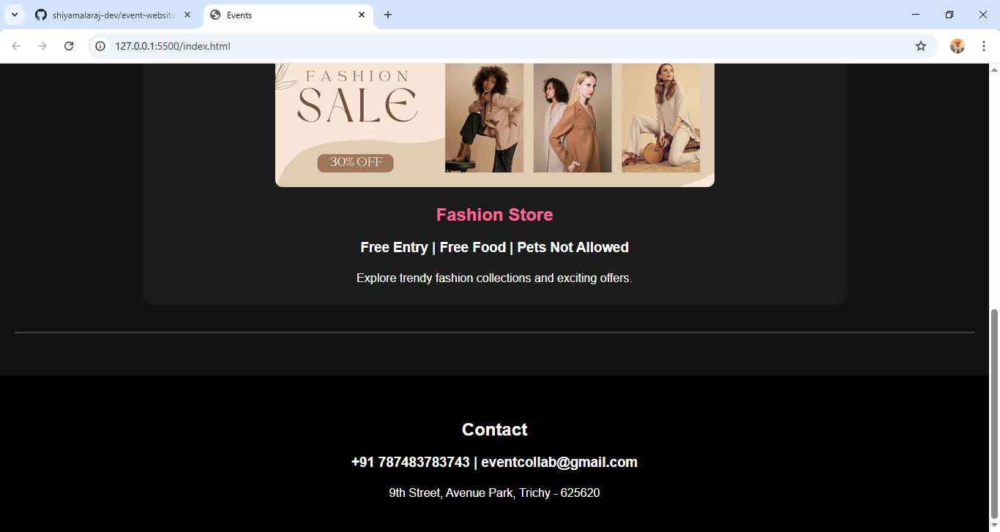

# 🎉 Event Website

A simple and visually appealing **event landing page** built using HTML.  
This project showcases upcoming events with images, descriptions, and contact details.

---

## 🚀 Features

📅 Upcoming Events Section  
🖼️ Event Image Preview  
🔗 Clickable Links (Fashion Store)  
🎨 Clean Dark Theme UI  
📱 Simple and Responsive Layout  
📞 Contact Information Section  

---

## 🛠️ Technologies Used

- HTML5  
- Basic CSS (inline styling)

---

## 📸 Screenshots

### 🏠 Home Page

### 🖼️ Event Section

### 📞 Contact Section

---

## 🌐 Live Demo

👉 https://shiyamalaraj-dev.github.io/event-website/

---

## 📌 Author

👩‍💻 Shiyamala K  
📧 shiyamalaraj2001@gmail.com  
🔗 https://linkedin.com/in/shiyamalaraj-design  

---

## 💡 Project Type

This is a **static website / landing page** project created for learning and showcasing basic web development skills.
